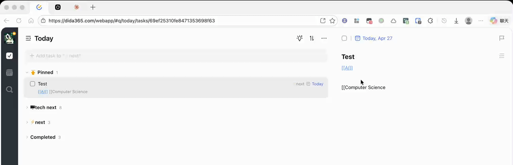

# TickTick Logseq Link

A userscript that converts `[[page name]]` syntax in TickTick / Dida365 into clickable links that open the corresponding page in Logseq.

## Prerequisites

- A userscript manager browser extension, such as:
  - [Tampermonkey](https://www.tampermonkey.net/) (recommended)
  - [Violentmonkey](https://violentmonkey.github.io/)
  - [Greasemonkey](https://www.greasespot.net/) (Firefox only)
- [Logseq](https://logseq.com/) desktop app installed on your machine

## Installation

1. Make sure your userscript manager extension is installed and enabled.
2. Open the [`ticktick-logseq.user.js`](ticktick-logseq.user.js) file, then click the **Raw** button (on GitHub) — your userscript manager should prompt you to install.
3. Alternatively, open your userscript manager dashboard, create a new script, and paste the contents of `ticktick-logseq.user.js`.

## Configuration

### Set your Logseq Graph name

The script needs to know your Logseq graph name to generate the correct `logseq://` URL.

1. Open [TickTick](https://ticktick.com) or [Dida365](https://dida365.com).
2. Click the userscript manager icon in your browser toolbar.
3. Under **TickTick Logseq Link**, click **Set Logseq Graph Name**.
4. Enter your graph name in the prompt and confirm.

> **How to find your graph name:** Open Logseq, click the graph name in the top-left corner — that's the name you need.

The default graph name is `logseq`. Your setting is saved persistently and only needs to be configured once.

## Usage

Write `[[page name]]` anywhere in your TickTick / Dida365 tasks (title, description, comments, etc.). The script will automatically convert it into a blue clickable link. Clicking the link opens the page in Logseq.

**Examples:**

| You write                | Link opens                                             |
| ------------------------ | ------------------------------------------------------ |
| `[[Meeting Notes]]`      | `logseq://graph/YourGraph?page=Meeting%20Notes`        |
| `[[Project/Design Doc]]` | `logseq://graph/YourGraph?page=Project%2FDesign%20Doc` |

## Supported Sites

- `ticktick.com`
- `dida365.com`
